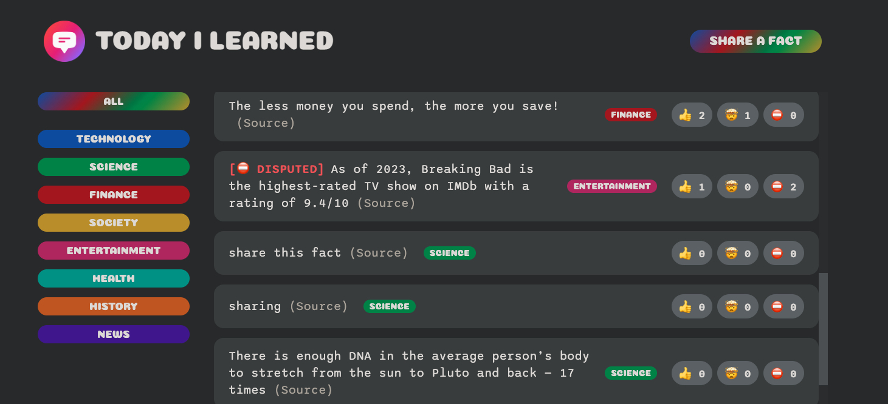

# Full Stack Fact REACT Application


**Table of Contents**
- [Introduction](#introduction)
- [Motivation](#motivation)
- [Technology Used](#technologyUsed)
- [Build Status](#buildStatus)
- [Features](#features)
- [Installation](#installation)
- [Execution](#execution)

## Introduction <a name="introduction"></a>
A full stack application where you can share facts across various categories and rank them.

https://chi-fact-forum.netlify.app/

## Motivation <a name="motivation"></a>
This is a personal learning project aimed to further knowledge of front-end development by using modern frameworks such as REACT and to learn how to put together a back-end database with APIs.

## Technology Used <a name="technologyUsed"></a>
<table>
  <tbody>
    <tr>
      <td>Language</td>
      <td>JavaScript, HTML and CSS</td>
    </tr>
    <tr>
      <td>Frameworks</td>
      <td>REACT</td>
    </tr>
    <tr>
      <td>Database</td>
      <td>Supabase (vendor solution for back-end database)</td>
    </tr>
    <tr>
      <td>Hosting</td>
      <td>Netlify (vendor solution for online web app hosting)</td>
    </tr>
    <tr>
      <td>Notable Technology Utilized</td>
      <td>
          <ul>
              <li>JavaScript, HTML and CSS Languages</li>
              <li>React framework</li>
              <li>Responsive web layout</li>
              <li>POST API to share fact</li>
              <li>GET API and SQL to retrieve forum facts</li>
              <li>Layout desinging, use states and onclicklisteners</li>     
          </ul>
      </td>
    </tr>
  </tbody>
</table>

## Build Status <a name="buildStatus"></a>
Project is completed.

## Features <a name="features"></a>
- Share a fact
- Drill down menu
- Vote on buttons
- Source
- Disputed
- Resizable window

### Share a fact


* User can input a random text fact with a source and a category from the dropdown
* There is a 200 character limit which state changes as the user types
* Upon clicking "Post" the form is disabled before closing once successfully uploaded (used POST API)

### Drill down menu


* User can filter all the facts by clicking on different categories on the menu to the left
* When a new category is selected the content view is re-rendered with the results of the filtered SQL query

### Vote on buttons


* User can vote on a fact by selecting the different icons
* The fact is ordered by the number of thumbs up plus mindblown facts in descending order

### Resizable window


* The web is transformed depending on the screensize it is being viewed on

### Disputed


* If a fact has more red down votes than thumbs up plus mindblown it is tagged with a "Disputed" tag

### Source


* User can click on "(Source)" which will open a new tab into the source of the fact

# Installation <a name="installation"></a>
In the project directory, you can run:

```
npm install
```

# Execution <a name="execution"></a>
In the project directory, you can run:

```
npm run start
```

This runs the app in the development mode.\
Open [http://localhost:3000](http://localhost:3000) to view it in your browser.

The page will reload when you make changes.\
You may also see any lint errors in the console.

Alternatively, you may play around with the live web version - https://chi-fact-forum.netlify.app/ 
